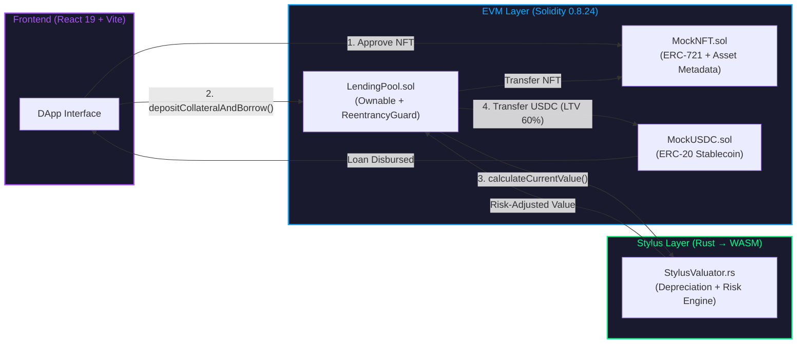

<p align="center">
  
  
  
  
  
  
</p>

<h1 align="center">Colateral-X</h1>
<h3 align="center">RWA Lending Protocol on Arbitrum Stylus</h3>
<p align="center">
  <em>Unlocking $1.8T in SME liquidity using Rust-based asset valuation on-chain.</em>
</p>

---

## The Problem

Small and medium enterprises (SMEs) in Latin America generate **60% of GDP** yet face a **$1.8 Trillion financing gap**. Banks require real estate collateral. SMEs own **movable assets** — machinery, trucks, inventory — that traditional DeFi cannot safely value on-chain due to EVM gas limits on complex financial math.

## The Solution

**Colateral-X** is an NFT-collateralized lending protocol that uses **Arbitrum Stylus** to run a Rust/WASM valuation engine on-chain. This engine computes real-time asset depreciation, risk scoring, and LTV calculations at **~99.9% lower gas cost** than equivalent Solidity. SMEs tokenize their real-world assets as NFTs and receive instant USDC loans.

<p align="center">
  
</p>

---

## Architecture



### Why Stylus?

| Capability | Solidity (EVM) | Stylus (Rust/WASM) |
| :--- | :--- | :--- |
| **Depreciation Model** | Simple linear only | Non-linear curves + residual floors |
| **Gas Cost per Valuation** | ~$50 | **~$0.04** |
| **Arithmetic Safety** | Unchecked by default | Rust checked arithmetic |
| **Complex Math** | Expensive loops | Native WASM performance |
| **Memory Safety** | Manual mgmt | Compile-time guarantees |

---

## Deployed Contracts (Arbitrum Sepolia)

| Contract | Address | Explorer |
| :--- | :--- | :--- |
| **LendingPool** | `0xFc9f8c4107c6d4c2AFBdB7D25A30447FaB63b9bC` | [View](https://sepolia.arbiscan.io/address/0xFc9f8c4107c6d4c2AFBdB7D25A30447FaB63b9bC) |
| **StylusValuator** | `0x023223d7b651a007dc42980cb9ca75f1e795eee1` | [View](https://sepolia.arbiscan.io/address/0x023223d7b651a007dc42980cb9ca75f1e795eee1) |
| **MockUSDC** | `0x265e31a371eFdDC5E6922E68dEaf5045E57f8429` | [View](https://sepolia.arbiscan.io/address/0x265e31a371eFdDC5E6922E68dEaf5045E57f8429) |
| **MockNFT** | `0xAb78688e3B83f56c58bDf7D2520F5cA590EcDB2d` | [View](https://sepolia.arbiscan.io/address/0xAb78688e3B83f56c58bDf7D2520F5cA590EcDB2d) |

> **Network:** Arbitrum Sepolia (Chain ID: 421614)  
> **Deployer:** `0x66603e1b70cC600Cf2eb0aA777F66b8bCB63921a`  
> **Stylus Contract:** Cached in ArbOS for optimized gas

---

## Features

### 15 Real-World Asset Classes
Tractors, GPU clusters, solar farms, mining trucks, MRI machines, container fleets — each with unique depreciation curves, risk ratings (AAA to B+), and sector classification.

### Rust Risk Engine (Stylus/WASM)
The valuation engine computes:
- **Time-based depreciation** with residual value floors (10%)
- **Risk-adjusted discounts** for high-risk assets (score > 50)
- **Batch valuations** for portfolio-level analysis
- **Depreciation schedules** for 10-year asset lifecycle projections

### Institutional Dashboard
Bloomberg Terminal-inspired interface with 5 sections:
- **Dashboard** — TVL, active loans, gas savings KPIs
- **Market** — Filterable asset grid with sector tags
- **Risk Engine** — Sector distribution, risk matrix, live Stylus feed
- **Governance** — DAO proposals with on-chain voting
- **Settings** — MockUSDC faucet, debug console, config

### Security
- OpenZeppelin `Ownable` + `ReentrancyGuard`
- CEI pattern (Checks → Effects → Interactions)
- Immutable contract references
- Zero-value valuation revert protection

---

## Repository Structure

```
CollateralX/
├── stylus-core/          # Rust/WASM valuation engine
│   ├── src/
│   │   ├── lib.rs        # Stylus contract entrypoint
│   │   └── valuation.rs  # Pure business logic (206 lines)
│   ├── Cargo.toml
│   └── rust-toolchain.toml
│
├── evm-contracts/        # Solidity smart contracts
│   ├── contracts/
│   │   ├── LendingPool.sol          # Core lending logic (231 lines)
│   │   ├── interfaces/IStylusValuator.sol
│   │   └── mocks/
│   │       ├── MockUSDC.sol         # ERC-20 test token
│   │       └── MockNFT.sol          # ERC-721 with asset metadata
│   ├── scripts/deploy.js
│   └── hardhat.config.js
│
├── frontend/             # React 19 + TypeScript + Vite 6
│   ├── src/
│   │   ├── App.tsx                  # Landing page
│   │   ├── components/
│   │   │   ├── DashboardLayout.tsx  # Sidebar + topbar shell
│   │   │   └── LoanDashboard.tsx    # 5-section terminal UI
│   │   ├── contracts.ts             # ABIs + deployed addresses
│   │   └── wagmi.ts                 # Chain config
│   └── package.json
│
└── README.md
```

---

## Getting Started

### Prerequisites

| Tool | Version | Purpose |
| :--- | :--- | :--- |
| Node.js | ≥ 18 | Frontend + Hardhat |
| Rust | nightly-2025-06-01 | Stylus contracts |
| cargo-stylus | 0.5.7+ | Deploy WASM contracts |
| MetaMask | Latest | Wallet connection |

### 1. Clone & Install

```bash
git clone https://github.com/your-org/CollateralX.git
cd CollateralX
```

### 2. Deploy Stylus Valuator (Rust)

```bash
cd stylus-core
cargo stylus deploy \
  --private-key-path .key \
  --endpoint "https://sepolia-rollup.arbitrum.io/rpc" \
  --no-verify
```

### 3. Deploy EVM Contracts (Solidity)

```bash
cd evm-contracts
npm install
# Set PRIVATE_KEY in .env
npx hardhat run scripts/deploy.js --network arbitrumSepolia
```

### 4. Run Frontend

```bash
cd frontend
npm install
npm run dev
# Open http://localhost:5173
```

### 5. Test the Flow

1. Connect MetaMask to **Arbitrum Sepolia**
2. Go to **Settings** → Click **"Mint 100K USDC"**
3. Go to **Market** → Select any asset
4. Click **"Request Loan"** → Approve NFT → Confirm Borrow
5. Observe USDC disbursed to your wallet

---

## How It Works (Technical Flow)

```
User calls depositCollateralAndBorrow(tokenId)
  │
  ├─ 1. NFT.safeTransferFrom(user → pool)
  │
  ├─ 2. NFT.assetMetadata(tokenId)
  │     → returns (assetType, initialValue, purchaseDate, riskScore)
  │
  ├─ 3. StylusValuator.calculateCurrentValue(...)     ← Rust/WASM
  │     → Depreciation curve + risk adjustment
  │     → Returns currentValue in USDC units
  │
  ├─ 4. loanAmount = currentValue × 60% (LTV)
  │
  ├─ 5. Verify pool liquidity ≥ loanAmount
  │
  ├─ 6. Create Loan record (state update FIRST — CEI)
  │
  └─ 7. USDC.transfer(user, loanAmount)
```

---

## Judge's Quick Guide

| Step | Action | Expected Result |
| :--- | :--- | :--- |
| 1 | Get Sepolia ETH | [Faucet](https://www.alchemy.com/faucets/arbitrum-sepolia) |
| 2 | Connect wallet | Address shown in topbar, "Arbitrum Sepolia" green indicator |
| 3 | Mint USDC | Settings → "Mint 100K USDC" → MetaMask confirms |
| 4 | Browse Market | 15 assets across 6 sectors with real Unsplash photos |
| 5 | Open Asset Modal | See valuation, Contract Logic tab shows Stylus vs Solidity |
| 6 | Request Loan | Approve NFT → Borrow → USDC transferred |
| 7 | Check Arbiscan | Internal tx from LendingPool → StylusValuator visible |

---

## Tech Stack

| Layer | Technology |
| :--- | :--- |
| Smart Contracts | Solidity 0.8.24, Arbitrum Stylus SDK 0.10.0 (Rust) |
| Framework | Hardhat 2.28, OpenZeppelin 5.4 |
| Frontend | React 19, TypeScript 5.6, Vite 6.4, Tailwind CSS v4 |
| Web3 | Wagmi v2, RainbowKit v2, viem v2 |
| UI | lucide-react, framer-motion |
| Network | Arbitrum Sepolia (Chain ID: 421614) |

---

## Roadmap

| Phase | Timeline | Milestone |
| :--- | :--- | :--- |
| **v1.0** | Q1 2026 | Hackathon MVP — Stylus valuator + LendingPool + Dashboard |
| **v1.5** | Q2 2026 | Chainlink CCIP for cross-chain collateral |
| **v2.0** | Q3 2026 | Legal wrapper integration (Kleros arbitration) |
| **v3.0** | Q4 2026 | Arbitrum One mainnet launch |

---

## Team

Built by the **Colateral-X** team for the Arbitrum Stylus Buildathon.

## License

MIT
